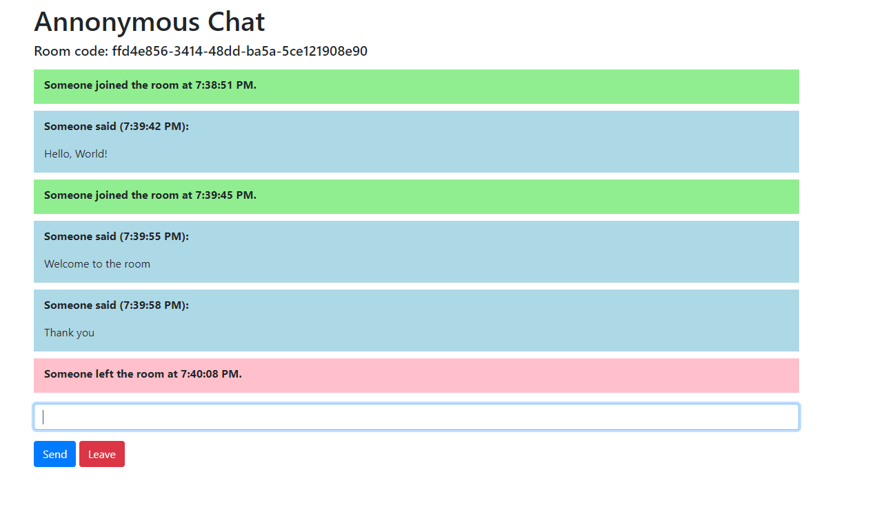
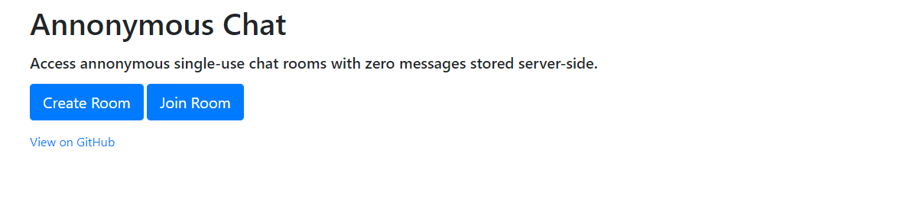
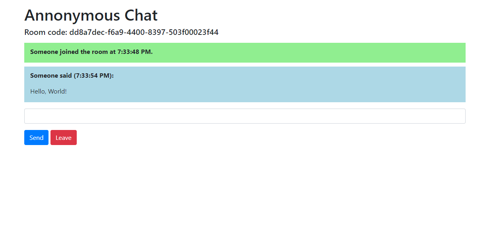
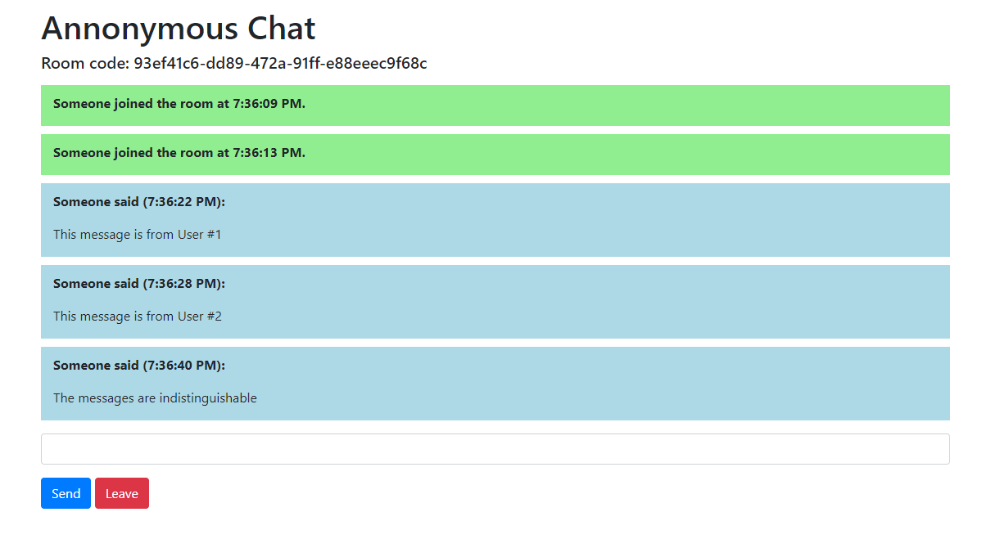
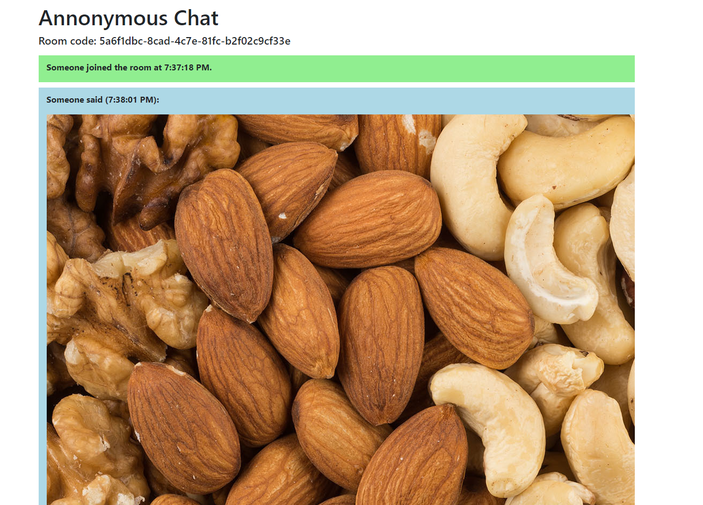
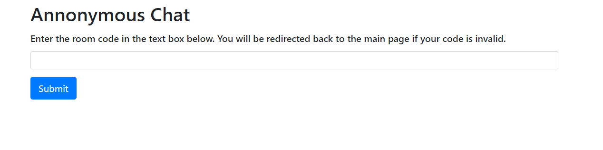

<br />
<p align="center">
  <h2 align="center">Anonymous Chat</h3>

  <p align="center">
    Anonymous single-use chatrooms using Flask and SocketIO
    <br />
</p>


<!-- TABLE OF CONTENTS -->
<details open="open">
  <summary><h2 style="display: inline-block">Table of Contents</h2></summary>
  <ol>
    <li>
      <a href="#about-the-project">About The Project</a>
    </li>
    <li>
      <a href="#getting-started">Getting Started</a>
      <ul>
        <li><a href="#prerequisites">Prerequisites</a></li>
        <li><a href="#installation">Installation</a></li>
      </ul>
    </li>
    <li><a href="#gallery">Gallery</a></li>
    <li><a href="#license">License</a></li>
    <li><a href="#contact">Contact</a></li>
    <li><a href="#acknowledgements">Acknowledgements</a></li>
  </ol>
</details>



<!-- ABOUT THE PROJECT -->
## About The Project

This project is a Flask web application that allows annonymous users to create and join chat rooms. After creating a room, a user can distribute the link so that others can join the same room. If a room is empty, it is automatically deleted. To increase security, only rooms codes are stored in the database, not any of the messages, which are rendered using markdown client-side.

<!-- GETTING STARTED -->
## Getting Started

To get a local copy up and running follow these simple steps.

### Prerequisites

You must have Python 3.6 or higher installed.

### Installation

1. Clone the repo and move into it
   ```sh
   git clone https://github.com/BattleMage0231/anonymous-chat.git
   cd anonymous-chat
   ```
2. Install the required packages
   ```sh
   pip3 install -r requirements.txt
   ```
3. Set up the environmental variables and database
   ```sh
   export FLASK_APP=run.py
   export AC_SECRET="SECRET KEY"
   export AC_DATABASE_URI="DATABASE URI"
   python3 init.py # create database
   ```
4. For local use, run the application using the command line
   ```sh
   flask run
   ```

For production uses, you should use an existing service to run the application. Do not expose it in debug mode.

## Gallery







<!-- LICENSE -->
## License

Distributed under the MIT License. See `LICENSE` for more information.

<!-- CONTACT -->
## Contact

Leyang Zou - leyang.zou@student.tdsb.on.ca

Project Link: [https://github.com/BattleMage0231/anonymous-chat](https://github.com/BattleMage0231/anonymous-chat)


<!-- ACKNOWLEDGEMENTS -->
## Acknowledgements

* [GitHub README template](https://github.com/othneildrew/Best-README-Template)
* [Flask](https://github.com/pallets/flask)
* [Flask-SQLAlchemy](https://github.com/pallets/flask-sqlalchemy)
* [Flask-SocketIO](https://github.com/miguelgrinberg/Flask-SocketIO) 

